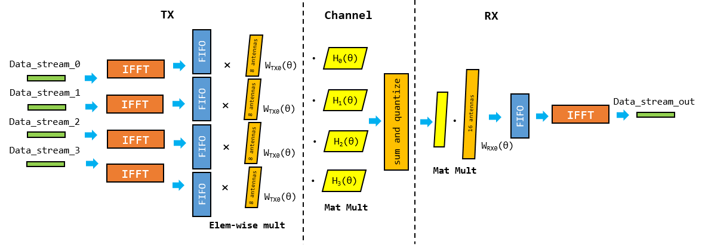
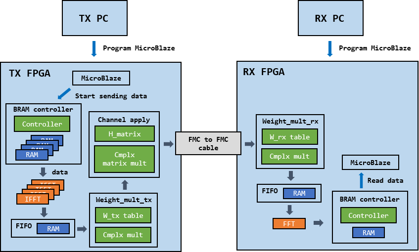

# FPGA Implementation of a Beamforming System

This project implements a beamforming simulation system on FPGAs. Both the TX and the RX sides use Xilinx VC707 boards, and the TX and the RX VC707 boards are hardwired with FMC-to-FMC cable as shown below. RX FPGA logic runs with the clock generated in the TX FPGA. This project checks whether the RX side properly restores the selected datastream, even though the RX receives all 4 datastreams.

The figure below summarizes what consists of a simple beamforming system. In this system, the TX has 4 linear subarray antennas, and each subarray consists of 8 antennas that sum up to total **32 antennas** in the TX system. The RX system has 1 linear subarray antenna, and it consists of **16 antennas**. From the TX side, it creates four beams with different directions for four datastream, and the RX chooses one of the datastream by properly setting the theta. 

  

In the project, there are two versions:
- SW simulation written in Python
- HW implementation written in Verilog(Xilinx Vivado project file)

## SW simulation
- **sim_linear.py** contains all the modules shown the figure above.

- **sim_linear_analysis.py** changes ADC quantization bit from 3 to 1 and checks how much data loss occurs as it quantizes more. The experiment shows _the quantization bit of 3_ results in zero data loss in the experiment setting.

Files below are the scripts that are necessary in HW implementation.

- **fixed_point_converter.py** contains `convert2Fixed16_15` and `convert2Fixed19_15` functions that convert float values into fixed point values to be used in the digital systems.

- **coe_gen.py** generates _data\_stream\_*.coe_ files, and _.coe_ files are used in initializing BRAMs on FPGA.

- **mem_file_gen.py** generates _.mem_ file based on _data\_stream\_*.coe_ files. I initially thought _coe\_gen.py_ would do the job but then realized that when BRAM controller is used in Vivado, I need to initialize BRAMs with `updatemem` command with _.mem_ file in Vivado console.

- **w_rx_fixed_point_converter.py** generates some verilog code that's used in HW implementation.

## HW simulation
The figure below shows HW modules in both the TX and the RX FPGAs.

  

- **/bf\_tx**: the TX FPGA design implemented on Xilinx VC707 board.
- **/bf\_rx**: the RX FPGA design implemented on Xilinx VC707 board.

The system flow is shown below. For details, check _./bf_tx/README.md_ and _./bf_tx/README.md_.

1. Generate bitstreams for both the TX FPGA and the RX FPGA.
2. Launch SDKs for both the TX FPGA's Microblaze and the RX FPGA's Microblaze.
3. Program both FPGAs with corresponding bitstreams.
4. Start sending datastream by running the TX Microblaze.
5. Start reading datastream by running the RX Microblaze.
